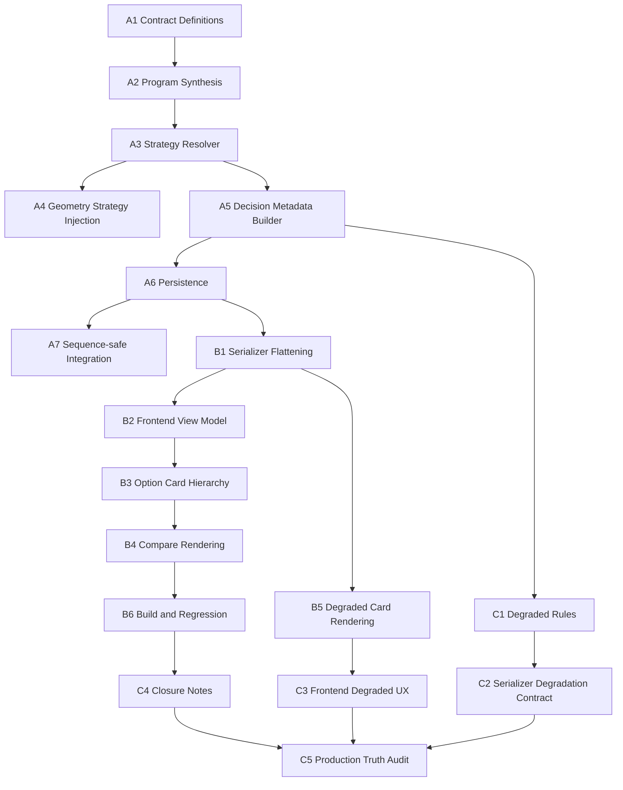

# Phase 5 Technical Task Breakdown: Option Strategy Profiles and Decision Metadata

## 1. Purpose

This document turns the Phase 5 option-strategy slice into executable engineering work.

It is specifically for three delivery lanes:

1. backend contract and persistence,
2. serializer and frontend consumption,
3. validation and degraded-mode handling.

The goal is to let multiple engineers work in parallel without losing contract integrity.

## 2. Delivery Model

## 2.1 Shared delivery principle

This work must stay contract-first.

That means the order is:

1. define durable backend truth,
2. serialize stable frontend fields,
3. validate degraded and production behavior.

Do not start from UI-only copy changes.

Do not let frontend invent missing content.

## 2.2 Shared invariants

All three lanes must preserve these invariants:

1. Strategy identity is backend-authored.
2. Decision explanation is derived from known brief, geometry, and rules.
3. Backward compatibility remains intact through `option_label` and `option_description`.
4. Missing metadata is surfaced explicitly as degraded state.
5. Generated options must not enter review before explicit option selection.

## 2.3 Domain entities

This breakdown assumes the following entities remain in play:

- `project`
- `design_version`
- `generation_metadata`
- `program_synthesis`
- `option_strategy_profile`
- `decision_metadata`

## 2.4 Execution model

Recommended delivery sequence:

1. Lane A builds backend truth first.
2. Lane B starts once the serialized response contract is stable enough.
3. Lane C starts early on degraded rules and completes last with production validation.

Parallelism rule:

- Lane A Task Group A1-A3 blocks most of Lane B.
- Lane B UI layout work can begin in parallel with Lane A serialization.
- Lane C degraded rules should be drafted alongside Lane A, then validated after Lane B integration.

## 3. Lane Overview

| Lane | Primary Owner | Main Goal | Primary Checkpoints |
|---|---|---|---|
| Lane A | Backend engineer | Make strategy and decision metadata real backend truth | CP4, CP5 |
| Lane B | Frontend engineer with API pairing | Consume structured fields and turn `Designs` into a decision workspace | CP5 |
| Lane C | QA / full-stack / release owner | Make degraded handling explicit and validate real production behavior | CP6 |

## 4. Lane A — Backend Contract and Persistence

## 4.1 Goal

Create the durable backend contract for:

- `program_synthesis`
- `option_strategy_profile`
- `decision_metadata`

and persist it with every generated version.

## 4.2 Write scope

Primary files:

- `../ai-architect-api/app/api/v1/generation.py`
- `../ai-architect-api/app/api/v1/projects.py`
- `../ai-architect-api/app/services/geometry.py`
- `../ai-architect-api/app/services/state_machine.py`
- `../ai-architect-api/app/models.py`

New files:

- `../ai-architect-api/app/services/option_strategy_profiles.py`
- `../ai-architect-api/app/services/decision_metadata.py`

Tests:

- `../ai-architect-api/tests/test_option_strategy_profiles.py`
- `../ai-architect-api/tests/test_decision_metadata.py`
- `../ai-architect-api/tests/test_flows.py`

## 4.3 Lane A tasks

### A1. Define internal contracts

Goal:

- formalize the exact Python dict shape for `program_synthesis`, `option_strategy_profile`, and `decision_metadata`.

Files to add or change:

- `../ai-architect-api/app/services/option_strategy_profiles.py`
- `../ai-architect-api/app/services/decision_metadata.py`

Output:

- named contract constants or typed schemas,
- field-level defaults,
- required vs optional field behavior.

Tests:

- contract fixtures round-trip without missing required fields.

Done when:

- every downstream service can rely on the same shape.

### A2. Build program-synthesis reducer

Goal:

- derive the minimum internal synthesis object from `brief_json`.

Files to add or change:

- `../ai-architect-api/app/api/v1/generation.py`
- or a helper under `../ai-architect-api/app/services/`

Output:

- deterministic reducer from brief to `program_synthesis`.

Tests:

- sparse brief produces reduced output plus degraded markers,
- rich brief produces expected priority tags and required spaces.

Done when:

- strategy resolution does not need to read raw brief fields ad hoc.

### A3. Implement strategy-profile resolver

Goal:

- assign distinct strategy profiles across sibling options.

Files to add or change:

- `../ai-architect-api/app/services/option_strategy_profiles.py`

Output:

- `resolve_option_strategy_profiles(...)`,
- typology-aware differentiation rules,
- fallback behavior when the brief is sparse.

Tests:

- townhouse and villa cases do not return duplicate primary strategies unless degraded,
- strategy titles and keys remain stable for the same inputs.

Done when:

- the backend can explain why option 1 differs from option 2 and option 3.

### A4. Inject strategy into geometry generation

Goal:

- make geometry generation aware of explicit strategy rather than only `option_index`.

Files to add or change:

- `../ai-architect-api/app/services/geometry.py`
- `../ai-architect-api/app/api/v1/generation.py`

Output:

- geometry input accepts strategy overrides,
- option layout differences become intentionally rule-driven.

Tests:

- strategy overrides change geometry-relevant outputs deterministically,
- old callers still work with compatibility defaults.

Done when:

- strategy profile materially influences layout behavior.

### A5. Implement decision-metadata builder

Goal:

- create user-facing explanation from backend truth, not from frontend copy hacks.

Files to add or change:

- `../ai-architect-api/app/services/decision_metadata.py`

Output:

- `build_decision_metadata(...)`,
- fit reasons,
- strengths,
- caveats,
- metrics,
- compare axes,
- degraded flags.

Tests:

- non-degraded metadata never returns empty `fit_reasons`,
- degraded metadata is explicit and deterministic.

Done when:

- option explanation becomes a persisted output of generation, not a view-only adornment.

### A6. Persist metadata on versions

Goal:

- store strategy and decision metadata inside `generation_metadata`.

Files to add or change:

- `../ai-architect-api/app/models.py`
- `../ai-architect-api/app/api/v1/generation.py`

Output:

- durable `generation_metadata.program_synthesis`,
- durable `generation_metadata.option_strategy_profile`,
- durable `generation_metadata.decision_metadata`,
- compatibility mapping into `option_label` and `option_description`.

Tests:

- persisted versions include the new nested metadata,
- compatibility fields mirror the structured fields.

Done when:

- the backend can reload a version and still render the decision workspace without recomputing copy.

### A7. Sequence-safe integration

Goal:

- ensure the new metadata contract does not break the corrected Phase 5 state sequence.

Files to add or change:

- `../ai-architect-api/app/services/state_machine.py`
- `../ai-architect-api/app/api/v1/generation.py`
- `../ai-architect-api/tests/test_flows.py`

Output:

- metadata survives generation and selection transitions,
- generated options remain distinct from review state.

Tests:

- generation completion does not imply review,
- selected version enters review with full metadata preserved.

Done when:

- Lane A satisfies the CP4 backend gate.

## 4.4 Lane A exit criteria

Lane A is complete when:

- every generated option persists structured strategy and decision metadata,
- compatibility fields still work,
- state transitions remain correct,
- and tests prove persistence plus sequence integrity.

## 5. Lane B — Serializer and Frontend Consumption

## 5.1 Goal

Turn backend truth into a stable frontend contract and use it to rebuild the `Designs` page as a decision workspace.

## 5.2 Write scope

Primary files:

- `../ai-architect-api/app/api/v1/projects.py`
- `../ai-architect-api/app/api/v1/generation.py`
- `../ai-architect-web/src/components/designs-client.tsx`
- `../ai-architect-web/src/components/status-badge.tsx`

Optional frontend support files:

- `../ai-architect-web/src/lib/`
- `../ai-architect-web/src/types/`

## 5.3 Lane B tasks

### B1. Flatten serializer fields

Goal:

- expose strategy and decision fields as top-level response properties.

Files to add or change:

- `../ai-architect-api/app/api/v1/projects.py`

Output:

- `option_title_vi`
- `option_summary_vi`
- `option_strategy_key`
- `option_strategy_label_vi`
- `fit_reasons`
- `strengths`
- `caveats`
- `metrics`
- `compare_axes`
- degraded flags

Tests:

- serializer returns stable field names even when nested metadata is missing or partial.

Done when:

- frontend does not have to unpack raw JSON blobs to render the primary card.

### B2. Define frontend view model

Goal:

- normalize API payload into one explicit UI-facing option model.

Files to add or change:

- `../ai-architect-web/src/components/designs-client.tsx`
- optional `../ai-architect-web/src/types/`

Output:

- clear frontend type for rendered option cards,
- compatibility fallback mapping for legacy data.

Tests:

- legacy payload still renders safely,
- structured payload renders the richer view.

Done when:

- the page has one canonical card model instead of mixed ad hoc access.

### B3. Rebuild option-card content hierarchy

Goal:

- render strategy-aware content as first-class decision support.

Files to add or change:

- `../ai-architect-web/src/components/designs-client.tsx`

Output:

- Vietnamese title,
- strategy pill,
- summary,
- metrics block,
- strengths,
- caveats,
- clearer primary CTA.

Tests:

- option cards no longer rely on placeholder copy,
- strategy and rationale are visible above the fold.

Done when:

- the page reads like a curated decision surface rather than an image gallery.

### B4. Implement compare-state rendering

Goal:

- let users compare at least two options using meaningful metadata differences.

Files to add or change:

- `../ai-architect-web/src/components/designs-client.tsx`

Output:

- compare selection state,
- side-by-side or compare panel rendering,
- highlighted differences using `compare_axes`, `strengths`, `caveats`, and `metrics`.

Tests:

- compare mode handles two options,
- compare mode behaves sensibly when one option is degraded.

Done when:

- users can see why one option may fit better than another.

### B5. Handle degraded card rendering

Goal:

- make partial strategy or decision metadata visible without creating fake confidence.

Files to add or change:

- `../ai-architect-web/src/components/designs-client.tsx`
- `../ai-architect-web/src/components/status-badge.tsx`

Output:

- compact degraded badge or note,
- reduced CTA confidence if needed,
- no placeholder prose disguised as completed metadata.

Tests:

- degraded flags change the rendering state,
- non-degraded cards remain clean and uncluttered.

Done when:

- the UI stays honest about metadata quality.

### B6. Build and regression hardening

Goal:

- ensure the new page remains shippable after the richer contract lands.

Files to add or change:

- frontend files touched above

Output:

- passing frontend build,
- no eager websocket assumption,
- no hard-coded `Option A/B/C` dependency.

Tests:

- `pnpm build`
- grep-based checks for placeholder copy where appropriate

Done when:

- Lane B satisfies the CP5 frontend gate.

## 5.4 Lane B exit criteria

Lane B is complete when:

- the page consumes structured backend fields,
- compare mode uses real metadata,
- degraded state is visible and honest,
- and the UI no longer reads like placeholder output.

## 6. Lane C — Validation and Degraded-Mode Handling

## 6.1 Goal

Make the new contract safe under incomplete data and validate it against real production behavior.

## 6.2 Write scope

Primary files:

- `../ai-architect-api/app/services/decision_metadata.py`
- `../ai-architect-api/app/api/v1/projects.py`
- `../ai-architect-web/src/components/designs-client.tsx`
- `docs/phases/phase-5/checkpoints/cp6-production-validation-polish/*`
- `artifacts/production-checks/`
- `output/playwright/`

## 6.3 Lane C tasks

### C1. Define degraded-mode rules

Goal:

- decide when metadata is considered degraded and how that state is exposed.

Files to add or change:

- `../ai-architect-api/app/services/decision_metadata.py`
- reference docs if needed

Output:

- list of degraded triggers,
- explicit degraded reasons,
- threshold between non-blocking degradation and blocking quality failure.

Tests:

- missing household, orientation, or critical program inputs produce expected degraded output.

Done when:

- degraded behavior is policy-driven instead of ad hoc.

### C2. Validate serializer degradation contract

Goal:

- ensure partial backend truth still serializes predictably.

Files to add or change:

- `../ai-architect-api/app/api/v1/projects.py`
- serializer tests if present

Output:

- explicit `decision_metadata_degraded`,
- explicit reason list,
- no broken null handling in API responses.

Tests:

- sparse version payload still serializes cleanly,
- consumers can distinguish missing data from empty arrays.

Done when:

- downstream UI can trust degraded signals.

### C3. Validate frontend degraded UX

Goal:

- confirm the page stays professional even when option metadata is partial.

Files to add or change:

- `../ai-architect-web/src/components/designs-client.tsx`

Output:

- degraded-state rendering reviewed and adjusted,
- no duplicated warning noise,
- no hidden low-confidence state.

Tests:

- screenshot-based local check,
- compare mode with one degraded option remains readable.

Done when:

- degraded cards feel controlled, not broken.

### C4. Add observability and closure notes

Goal:

- make production validation explicitly evaluate strategy and decision quality.

Files to add or change:

- `docs/phases/phase-5/checkpoints/cp6-production-validation-polish/result.json`
- `docs/phases/phase-5/checkpoints/cp6-production-validation-polish/validation.json`
- `artifacts/production-checks/`

Output:

- final notes that explicitly judge:
  - strategy differentiation,
  - credibility of fit reasons,
  - usefulness of strengths and caveats,
  - degraded behavior.

Tests:

- checklist grep checks pass,
- evidence artifacts exist.

Done when:

- production closure covers quality, not only deploy success.

### C5. Run production truth audit

Goal:

- verify the slice against at least one real generated-options project.

Files to add or change:

- `output/playwright/`
- `artifacts/production-checks/`

Output:

- screenshots,
- production observations,
- final defect list if any.

Tests:

- health checks pass,
- screenshots saved,
- notes tied to CP6 acceptance checks.

Done when:

- Lane C satisfies the CP6 gate.

## 6.4 Lane C exit criteria

Lane C is complete when:

- degraded rules are explicit,
- API and UI behave predictably under partial data,
- and production validation explicitly judges option quality.

## 7. Suggested Team Split

## 7.1 Minimal team

If only two engineers are available:

- Engineer 1 owns Lane A
- Engineer 2 owns Lane B
- both pair on Lane C

## 7.2 Three-person split

- Engineer A owns Lane A
- Engineer B owns Lane B
- Engineer C owns Lane C and validation orchestration

## 7.3 Ownership boundaries

- Lane A should not rewrite frontend rendering decisions.
- Lane B should not invent backend fields.
- Lane C should not silently redefine the contract; it should escalate gaps back to Lane A or Lane B.

## 8. Dependency Graph

## 9. Recommended Execution Order

### Phase 1

- A1
- A2
- A3

### Phase 2

- A4
- A5
- A6
- B1

### Phase 3

- A7
- B2
- B3
- B4

### Phase 4

- C1
- C2
- B5
- B6

### Phase 5

- C3
- C4
- C5

## 10. Acceptance by Checkpoint

| Checkpoint | Required tasks |
|---|---|
| CP4 | A1, A2, A3, A4, A6, A7 |
| CP5 | B1, B2, B3, B4, B5, B6 |
| CP6 | C1, C2, C3, C4, C5 |

## 11. Merge Readiness Checklist

Before merging this slice:

- no placeholder labels remain the dominant end-user copy,
- serializer exposes flattened decision-ready fields,
- structured metadata survives persistence and review transition,
- degraded state is explicit and tested,
- compare mode uses meaningful metadata,
- production notes explicitly judge option quality.

## 12. Immediate Next Action

The most efficient next implementation step is:

1. complete Lane A through A6,
2. freeze the serializer contract in B1,
3. then let Lane B and Lane C proceed in parallel.

That sequencing reduces frontend rework and keeps the Phase 5 lane stable while quality improves.
