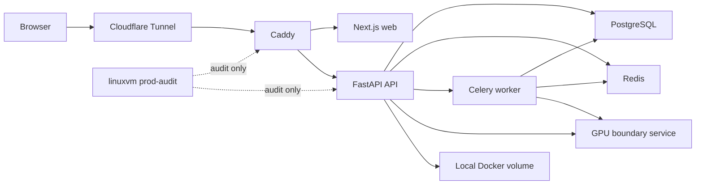
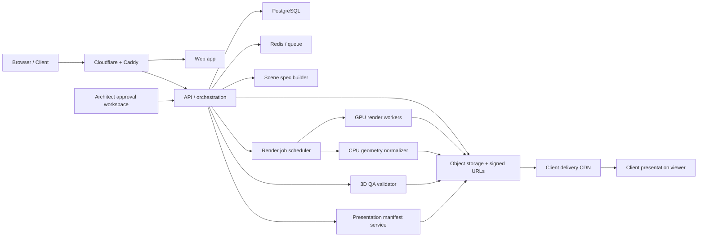

# Phase 6 - 3D Presentation Architecture and Hosting

## 1. Purpose

This document turns the Phase 6 research into an implementation-ready architecture for a professional 3D presentation lane.

It is written so that backend, frontend, GPU/render, DevOps, and product teams can all work from the same target.

The target outcome is:

- `scene.glb`
- curated still renders
- `walkthrough.mp4`
- `presentation_manifest.json`
- approval-gated client delivery

This document extends:

- [01-3d-output-research-and-direction.md](/Users/nguyenquocthong/project/ai-architect-mvp/implementation/phase-6/01-3d-output-research-and-direction.md)
- [02-3d-module-input-contracts.md](/Users/nguyenquocthong/project/ai-architect-mvp/implementation/phase-6/02-3d-module-input-contracts.md)

## 2. As-Is

### 2.1 Current production topology

The current production stack is a single-host Docker Compose deployment with internal service-to-service calls.

- Public edge enters through `cloudflared -> caddy`
- `web`, `api`, `worker`, `gpu`, `postgres`, and `redis` run on the same app host
- the GPU service is internal-only and is called by API at `http://gpu:8001`
- `linuxvm` is an operations and audit environment, not the active 3D runtime host

Evidence:

- [docker-compose.production.yml](/Users/nguyenquocthong/project/ai-architect-mvp/docker-compose.production.yml:1)
- [app/api/v1/derivation.py](/Users/nguyenquocthong/project/ai-architect-api/app/api/v1/derivation.py:23)
- [app/services/gpu_client.py](/Users/nguyenquocthong/project/ai-architect-api/app/services/gpu_client.py:85)
- [ai-architect-gpu/api/server.py](/Users/nguyenquocthong/project/ai-architect-gpu/api/server.py:211)
- [src/components/viewer-client.tsx](/Users/nguyenquocthong/project/ai-architect-web/src/components/viewer-client.tsx:47)

### 2.2 Current 3D request flow

Current `derive-3d` behavior is:

1. API checks that a version is already locked.
2. API sends `version_id + brief_json + first floor_plan_url` to the GPU boundary.
3. GPU boundary returns a thin glTF-like JSON and SVG placeholder renders.
4. API stores those files and writes `model_url + render_urls` back to the version.
5. Web viewer shows raw model text plus image previews.

This is a valid workflow stub, but it is not a client-ready 3D presentation pipeline.

### 2.3 Current runtime limitations

The current implementation is blocked at three different levels.

#### A. Source code limitations

- no `presentation_scene_spec`
- no deterministic geometry-to-scene assembler
- no style/material mapping consumed by the renderer
- no camera planner
- no video lane
- no manifest builder
- no QA validator for 3D fidelity
- no approval-gated release for client delivery

#### B. Runtime limitations

- GPU service is alive but reports `gpu_available:false`
- current GPU image is `python:3.12-slim`, not a Blender/CUDA render runtime
- no dedicated GPU worker host
- no object storage or CDN-backed artifact delivery
- no render queue or long-running render orchestration

#### C. Product limitations

- current output contract is only `model_url + render_urls`
- current viewer is a technical verification page
- there is no concept of `preview only` vs `client-deliverable approved`

### 2.4 As-is verdict

Current production can prove:

- locked-version gating
- artifact persistence
- internal service connectivity
- minimal 3D derivation plumbing

Current production cannot yet prove:

- design-faithful `scene.glb`
- curated room-aware render set
- walkthrough video
- delivery manifest
- architect-gated client release

## 3. Target Architecture

### 3.1 Target design principles

The target 3D system must follow these principles:

1. The 3D lane must consume approved design truth, not raw brief text.
2. The rendering layer must be deterministic and contract-driven.
3. `preview` and `client delivery` must be different states.
4. Stills, GLB, and video must come from the same scene truth.
5. Delivery must be blocked automatically when quality gates fail.

### 3.2 Target source-of-truth chain

The target upstream chain is:

`locked brief -> approved canonical 2D version -> issued package -> presentation_scene_spec -> render bundle -> QA report -> architect approval -> client delivery package`

This means Phase 6 must not read directly from:

- unstructured client intake
- prompt-only style text
- a single floor plan image

It must read from:

- canonical geometry
- approved room semantics
- issued package metadata
- style/material rules
- presentation directives

### 3.3 Target runtime architecture

### 3.4 Target logical modules

The target 3D lane should be split into these modules:

1. `presentation_scene_spec_builder`
- transforms approved 2D truth into a renderer-ready scene contract

2. `scene_asset_assembler`
- generates geometry hierarchy, materials, room staging directives, and camera list

3. `render_orchestrator`
- schedules and tracks still, GLB, and video jobs

4. `glb_export_lane`
- outputs `scene.glb`

5. `still_render_lane`
- outputs curated still images with named shot identities

6. `walkthrough_video_lane`
- outputs `walkthrough.mp4` from an explicit camera path

7. `presentation_manifest_service`
- writes the final structured manifest for delivery and viewer consumption

8. `qa_validator`
- evaluates geometry fidelity, shot completeness, naming, quality, and packaging readiness

9. `approval_gate`
- allows preview assets to exist but blocks client release until architect approval passes

### 3.5 Target output contract

The minimum professional output package should contain:

- `scene.glb`
- `scene_spec.json`
- `presentation_manifest.json`
- hero exterior render
- minimum interior renders for approved target rooms
- `walkthrough.mp4`
- QA report
- approval metadata
- branding and disclaimer metadata

Optional later additions:

- 360 panoramas
- downloadable presentation PDF
- WebGL hotspot viewer
- QR/link share package

## 4. Module-Host Mapping

### 4.1 Current host mapping

| Module | Current host | Runtime mode | Why it exists there now |
|---|---|---|---|
| Public edge | App host | `cloudflared + caddy` | Simplest public ingress |
| Web app | App host | Next.js container | Tight coupling to API and same deploy flow |
| API | App host | FastAPI container | Main product orchestration |
| Worker | App host | Celery container | Background jobs already available |
| Database | App host | PostgreSQL container | Single-node simplicity |
| Queue | App host | Redis container | Single-node simplicity |
| GPU boundary | App host | Python slim container | Internal service boundary only |
| Artifact storage | App host | Docker volume | Fast to bootstrap |
| Audit runner | `linuxvm` | External ops host | Production auditing only |

### 4.2 Target host mapping

| Module | Target host | Runtime mode | Why this host is correct |
|---|---|---|---|
| Public edge | Edge/app host | Cloudflare + reverse proxy | Stable ingress and TLS handling |
| Web app | App host | Next.js | Low-latency UI and simple release flow |
| API/orchestrator | App host | FastAPI | Owns project state, jobs, approval, manifests |
| Worker scheduler | App host | Celery or equivalent | Owns job dispatch, retries, and progress updates |
| Scene spec builder | App host | CPU service/module | Uses canonical data and business rules, not GPU |
| CPU geometry normalizer | App host or CPU worker node | CPU worker | Converts canonical package to scene assembly input |
| Render coordinator | App host | API/worker-owned orchestration | Tracks long-running render jobs |
| GPU render workers | Dedicated GPU node | Blender headless + FFmpeg + NVIDIA runtime | Heavy render work should not share the main app node |
| QA validator | App host | CPU worker/module | Rule-based validation against canonical truth |
| Manifest builder | App host | API/worker module | Must stay close to approval state and metadata |
| Object storage | External bucket or storage service | S3/R2-compatible | Durable artifacts, signed URLs, CDN handoff |
| CDN delivery | External CDN | Public asset delivery | Faster client viewing and safer download links |
| Ops/audit runner | `linuxvm` or separate ops node | Audit utilities | Kept out of the hot path |

### 4.3 Hosting decision summary

The key hosting decision is:

- keep product orchestration on the app host
- move render execution to dedicated GPU infrastructure
- move artifacts out of local Docker volume and into object storage

This split is required because professional 3D delivery has very different workload characteristics from normal API traffic.

## 5. Delivery Gates

Delivery must become an explicit gated pipeline, not just "files exist".

### Gate 0: Brief lock

Required:

- locked brief
- no unresolved critical contradictions
- generation-safe room and project data

Block reason:

- no 3D processing allowed from intake or unstable draft brief

### Gate 1: Canonical package issued

Required:

- approved canonical version
- issued 2D package
- stable room semantics
- stable opening and facade logic

Block reason:

- do not derive 3D from draft or unresolved review geometry

### Gate 2: Scene spec freeze

Required:

- `presentation_scene_spec.json`
- style/material mapping
- target shots and target rooms

Block reason:

- render jobs must not improvise from free text or missing scene metadata

### Gate 3: Render completeness

Required:

- valid `scene.glb`
- required still renders generated
- required video generated
- all artifacts stored and retrievable

Block reason:

- missing any required output means package is incomplete

### Gate 4: QA validation

Required:

- geometry check pass
- room naming check pass
- facade direction check pass
- render count pass
- video presence pass
- manifest integrity pass

Block reason:

- if QA fails, the package stays in `preview_degraded`

### Gate 5: Architect approval

Required:

- architect review completed
- approval note stored
- approved revision label assigned

Block reason:

- no client-facing issue without human approval

### Gate 6: Client delivery release

Required:

- signed delivery manifest
- approved asset list
- correct branding
- disclaimer policy applied
- signed URLs or viewer package generated

Block reason:

- if any upstream gate failed, client release is blocked

### Degraded-mode rule

If artifacts exist but fail QA:

- allow internal preview
- apply visible `DEGRADED` label
- block client issue package
- keep failure reason in manifest and job log

## 6. Implementation Checkpoints

The team should execute Phase 6 in the following checkpoints.

### CP1. Freeze 3D contracts

Scope:

- finalize `presentation_scene_spec`
- finalize render request schema
- finalize manifest schema
- finalize QA report schema

Done when:

- versioned JSON schemas exist
- API and worker code use the same schema package

### CP2. Replace current sync derive endpoint

Scope:

- replace direct `POST /derive-3d` sync flow with queued async jobs
- return `job_id`, status, and progress
- persist render job state

Done when:

- API no longer blocks on render
- frontend can poll or subscribe to progress

### CP3. Build scene spec builder

Scope:

- read canonical 2D package
- output deterministic `presentation_scene_spec.json`
- include geometry references, materials, shots, walkthrough path

Done when:

- scene spec can be generated repeatably from the same approved version

### CP4. Add artifact storage layer

Scope:

- move 3D artifacts out of local Docker volume
- use object storage for GLB, images, video, manifests, QA reports
- add signed URL generation

Done when:

- no client-facing 3D asset depends on local container volume paths

### CP5. Implement GLB export lane

Scope:

- build or integrate Blender headless scene export
- output `scene.glb`
- register asset metadata

Done when:

- approved version can generate a stable downloadable GLB asset

### CP6. Implement curated still render lane

Scope:

- define named shot presets
- render required exterior and interior shots
- store shot metadata and thumbnail set

Done when:

- package has predictable still outputs, not generic placeholder renders

### CP7. Implement walkthrough video lane

Scope:

- generate a deterministic camera path
- render frames or segments
- assemble `walkthrough.mp4` with FFmpeg

Done when:

- every approved package can produce one valid walkthrough video

### CP8. Implement QA validator and degraded mode

Scope:

- build rule-based QA engine
- compare outputs against canonical package and scene spec
- assign `pass`, `warning`, `fail`, and degraded reasons

Done when:

- low-quality packages are blocked automatically from client delivery

### CP9. Implement approval gate and client manifest

Scope:

- add architect approval UI and API
- write `presentation_manifest.json`
- separate preview state from issued client-delivery state

Done when:

- package release requires human approval and a valid manifest

### CP10. Replace technical viewer with client presentation viewer

Scope:

- remove raw model text view
- add hero preview, shot gallery, video player, and GLB viewer
- show approval state and degraded badge clearly

Done when:

- client-facing output is presentation-grade and not debug-oriented

### CP11. Deploy dedicated GPU runtime

Scope:

- create GPU image with Blender, FFmpeg, NVIDIA runtime
- deploy to dedicated GPU host
- connect render queue safely to that host

Done when:

- render workers report real GPU capability
- render jobs no longer depend on mock CPU boundary mode

### CP12. Production hardening

Scope:

- logging and tracing
- retries and dead-letter handling
- artifact retention policy
- alerting for failed render jobs and failed gates

Done when:

- the team can operate the 3D lane safely in production

## 7. Infra Requirements

### 7.1 Host classes

#### A. App host

Purpose:

- web
- API
- worker scheduler
- scene spec builder
- QA validator
- manifest service

Minimum starting spec:

- 4 to 8 vCPU
- 16 to 32 GB RAM
- SSD or NVMe disk

#### B. GPU render host

Purpose:

- Blender headless
- GLB export
- high-resolution still renders
- video frame generation
- FFmpeg assembly

Minimum starting spec:

- 12 to 16 vCPU
- 48 to 64 GB RAM
- NVIDIA GPU with 16 GB+ VRAM
- NVMe scratch disk

Recommended practical starting point:

- RTX 4090 24 GB or RTX A5000 24 GB class
- NVIDIA driver + `nvidia-container-toolkit`

#### C. Object storage

Purpose:

- durable artifact storage
- signed URL issuance
- CDN handoff

Required:

- bucket versioning or safe overwrite policy
- lifecycle rules
- prefix-level organization per project/version/job

#### D. Ops and audit host

Purpose:

- production audits
- release checks
- backup and restore verification

This can remain separate from the render hot path.

### 7.2 Software requirements

App side:

- FastAPI
- background job runner
- PostgreSQL
- Redis
- schema validation library

GPU side:

- Blender headless
- FFmpeg
- Python runtime
- NVIDIA driver
- `nvidia-container-toolkit`
- render presets and font/material asset pack

### 7.3 Network requirements

- GPU render nodes must not be public-facing
- API communicates with render workers over internal network only
- object storage access must use service credentials
- client downloads and viewer loads should use signed URLs or CDN URLs

### 7.4 Storage requirements

Do not keep final 3D assets only on local Docker volumes.

Use object storage with predictable prefixes such as:

- `projects/{project_id}/versions/{version_id}/scene/scene.glb`
- `projects/{project_id}/versions/{version_id}/renders/{shot_id}.png`
- `projects/{project_id}/versions/{version_id}/video/walkthrough.mp4`
- `projects/{project_id}/versions/{version_id}/manifest/presentation_manifest.json`
- `projects/{project_id}/versions/{version_id}/qa/qa_report.json`

### 7.5 Observability requirements

Required signals:

- render job queued/running/completed/failed
- GPU worker capability and utilization
- artifact upload failures
- QA gate failures
- architect approval latency
- client delivery release events

Required outputs:

- structured logs
- per-job trace ID
- render duration metrics
- alert on repeated failure or degraded spikes

### 7.6 Security requirements

- internal-only render workers
- signed URLs for asset access
- approval and release actions audited by user identity
- final manifest must record artifact hashes or immutable references

### 7.7 Deployment requirements

The recommended deployment shape is:

1. keep web/API/worker on the current app host
2. introduce a dedicated GPU host for render execution
3. move final assets to object storage
4. expose only web/API through the public edge

This is the smallest architecture that can realistically support professional 3D delivery without overloading the current app node.

## 8. Final Recommendation

The team should not try to jump directly from the current placeholder 3D lane to "client-ready 3D package" by only improving prompts or images.

The correct path is:

1. lock contracts
2. separate orchestration from rendering
3. deploy dedicated GPU runtime
4. add object storage and delivery manifest
5. introduce QA and architect approval gates
6. only then expose the package as client delivery

If the team follows this document in order, the system can move from a workflow stub to a professional presentation lane without mixing draft outputs and approved client-facing deliverables.
